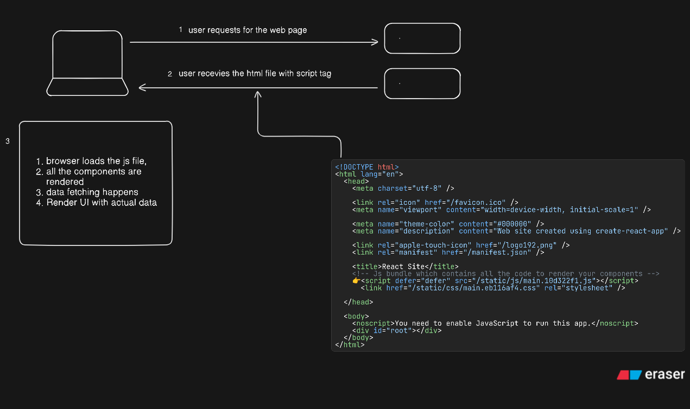

> This blog post is for people who are already using React and are willing to learn more about React Server Components.

React Server Components have been around for quite a few years, yet they’re still confusing for many people. They were at least confusing for me—so I started digging into the depths of Server Components and Server-Side Rendering. After experimenting with a few things and spending time on it, I’ve answered many of my own questions.

So, in this post, I’ll do my best to help you understand what React Server Components are and why we need them.

---

## Client-Side Only React (SPA)

If you’ve used `vite` or `CRA` to set up your React application, then you’ve probably made a _**Single Page Application**_. A Single Page Application is a web app implementation that loads a single document instead of requesting new pages from the server.

This is how a typical Single Page Application works:

1. The user requests a webpage from the server.
2. The user receives an HTML file (with no data about the component), and a `<script>` tag (which tells the browser where to download the JS bundle):

```html title="index.html" showLineNumbers

<!DOCTYPE html>
<html lang="en">
  <head>
    <title>React Site</title>
    <!-- JS bundle which contains all the code to render your components -->
    👉<script defer="defer" src="/static/js/bundle.js"></script> 
    <link href="/static/css/main.eb116af4.css" rel="stylesheet" /> 
  </head>
  <body>
    <noscript>You need to enable JavaScript to run this app.</noscript>
    <div id="root"></div>
  </body>
</html>

```

3. Once the JS is downloaded in the browser, **JavaScript** starts mounting all of your components inside that empty `<div id="root"></div>`.
4. If your component fetches any external data, it starts fetching the data.
5. Then, it re-renders the component with the actual data.

When you change the route from `/user` to `/dashboard`, instead of requesting a new page from the server, it just loads the JS needed to render the `/dashboard` component.

---

So, what’s the problem with this approach?

The biggest issue is **performance**. Downloading that JavaScript bundle takes time. While it’s downloading, all the user sees is a blank white screen.

Another issue is with **SEO**. Search engines use web crawlers to analyze your webpage’s content so they can index it properly. But in a typical SPA, the initial HTML is mostly empty and doesn't contain actual content. Not all search engines can execute JavaScript, and even if they can, it takes time. As a result, SPAs often struggle with SEO and also don’t show rich previews when shared on social media.

So, SPAs rely on a single HTML file which loads a different JS file to render everything. Good now let's move
on to server components



Before we dive into everything else, let’s fully understand what a SPA (Single Page Application) is—since that’s what we’ve been hearing about React for many years, right?

If you create a React application using `npm create vite@latest` or `npx create-next-app@latest`, you’ll see a file containing `index.html`, which looks something like the example above.

When you build your React application, all of your code gets bundled by tools like Webpack or Rollup. React (especially with CRA) uses **Webpack**.


---

## What is React Server Components?

Let’s check the official docs:

> Server Components are a new type of component that renders ahead of time, before bundling, in an environment separate from your client app or SSR server.

Okay, that sounds cool. But what does it actually mean?


